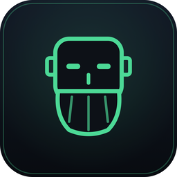

<div align="center">



# Cosmos Corp: Day One

**Learn the terminal, git, Kubernetes, and GitOps by actually doing the job.**

A macOS desktop RPG that drops you into your first week as an engineer at Cosmos Corp.
Real `bash`, real `git`, real `kubectl`, real `flux` - every mission runs against a
live, sandboxed Docker container, with a mentor named **Sage** walking you through it.

[](https://github.com/gothub97/cosmos-corp/actions/workflows/ci.yml)
[](https://github.com/gothub97/cosmos-corp/actions/workflows/release.yml)


</div>

---

## Why this exists

Most DevOps tutorials are read-only. You watch, you nod, nothing sticks. Cosmos Corp
flips that: there is no fake terminal and no multiple choice. You get a goal, a real
shell into a real container, and a validator that only turns the objective green when
you have genuinely done the thing. Sage gives you the mental model first, then hints
when you are stuck, then just tells you - because that is how learning on the job
actually works.

## Features

- **Real sandboxes, not simulations.** Each chapter spins up its own Docker container
  (and a real `k3s` cluster for the Kubernetes and Flux chapters). You break nothing
  that matters and learn on the genuine tools.
- **A mentor with a voice.** Sage, a bearded infra veteran, teaches in plain language,
  owns his own mistakes, and never condescends. Dialogue is personalized to you.
- **First-launch onboarding.** Name yourself, pick a role, get your Cosmos Corp ID
  badge, and start your first day.
- **Per-chapter theory courses** sourced from the official docs, re-readable any time.
- **Live cluster visualization** (React Flow) for the Kubernetes and FluxCD chapters -
  watch pods reconcile as you push commits.
- **Progressive hints + a real validator** so you are never truly stuck, but never
  handed the answer for free.
- **CRT / phosphor aesthetic** that makes the terminal feel like home.

## Chapter map

| # | Chapter | You will learn |
|---|---------|----------------|
| 1 | **The Terminal** | navigation, files, pipes, search, processes, permissions, env |
| 2 | **The Codebase** | commit, branch, merge, rebase, conflict resolution, remotes |
| 3 | **The Cluster** | pods, deployments, services, config, debugging on `k3s` |
| 4 | **The GitOps Loop** | FluxCD, reconciliation, drift correction, the push-to-deploy loop |

## Tech stack

| Layer | Tools |
|-------|-------|
| Shell | Tauri 2 (Rust) |
| Backend | `portable-pty`, Docker lifecycle, a per-objective validator, a versioned save store |
| Frontend | React 19, TypeScript, Vite, Zustand, Tailwind v4, xterm.js, React Flow |
| Sandboxes | Docker + `k3s` (privileged, airgapped image bundle) |

## Prerequisites

- macOS 13+ (Apple Silicon or Intel)
- [Docker Desktop](https://www.docker.com/products/docker-desktop/) or [Colima](https://github.com/abiosoft/colima)
- Node 20+ and [pnpm](https://pnpm.io/) 10+
- Rust stable - `curl https://sh.rustup.rs -sSf | sh`
- Xcode Command Line Tools - `xcode-select --install`

## Quickstart

```bash
pnpm install
pnpm tauri dev
```

The first launch drops you into onboarding. Make sure Docker is running before you
start your first mission.

## Build a release bundle

```bash
pnpm tauri build
# → src-tauri/target/release/bundle/dmg/Cosmos Corp_<version>_aarch64.dmg
```

## Repo layout

| Path | Purpose |
|------|---------|
| `src/` | React frontend - scenes, components, terminal, the Zustand store |
| `src/ipc/` | The shared IPC contract (the single source of truth across the Rust / React seam) |
| `src-tauri/` | Rust backend - PTY bridge, Docker + cluster lifecycle, validator, save store |
| `content/` | Mission YAML + dialogue + per-chapter courses (author without a rebuild) |
| `lab-images/` | Dockerfiles for the per-chapter sandboxes |
| `docs/` | Design notes, including the Sage character bible |
| `scripts/` | Build + release helper scripts |

## Releases & versioning

This repo uses [Changesets](https://github.com/changesets/changesets). To record a
change for the next release:

```bash
pnpm changeset
```

When that lands on `main`, a "Version Packages" PR is opened. Merging it bumps the
version, updates the changelog, and pushes a `v<version>` tag - which builds the macOS
bundle and publishes it to a [GitHub Release](https://github.com/gothub97/cosmos-corp/releases).
See [CONTRIBUTING.md](CONTRIBUTING.md) for the full workflow.

## Contributing

Contributions are welcome. Start with [CONTRIBUTING.md](CONTRIBUTING.md).

## License

[MIT](LICENSE) - built to help people learn.
